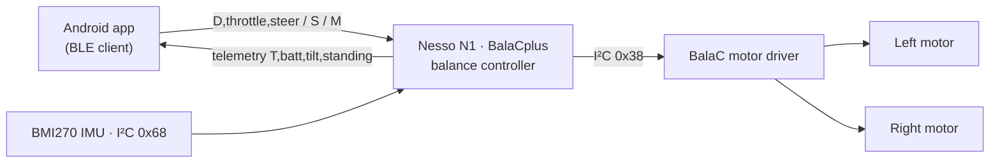

# Nesso N1 + BalaC — Balancing Robot Example


A self-balancing robot built from the **Kiraku Labo BalaC** base and an **Arduino Nesso N1**
(ESP32-C6) as the brain. This repo contains the robot firmware plus several ways to drive and
extend it: a Bluetooth LE Android app, a micro-ROS bridge, a camera-based controller, and a
Blockly teaching example.


## ⚡ Get started in 5 minutes

Grab the prebuilt artifacts from the **[latest release](https://github.com/edgeimpulse/nesso-balac-example/releases/latest)** — no toolchain required.

**A. Drive an assembled robot (~2 min)**

1. Download **`balac-control-*.apk`** from the [latest release](https://github.com/edgeimpulse/nesso-balac-example/releases/latest) and install it on an Android phone (enable *Install unknown apps* if prompted).
2. Power on the robot, open **BalaC Control**, tap **Connect**, then hold **Forward / Back / Left / Right**.

**B. Flash the firmware (~5 min)**

1. If the [latest release](https://github.com/edgeimpulse/nesso-balac-example/releases/latest) has a **`balac-firmware-*.bin`**, flash it straight from your browser with [esptool-js](https://espressif.github.io/esptool-js/): connect the Nesso N1 over USB-C, pick the port, select the `.bin`, and click **Program**.
2. No binary attached yet? Open [BalaCplus/BalaCplus.ino](BalaCplus/BalaCplus.ino) in the Arduino IDE, install the **Arduino Nesso N1** core + [libraries](README-libs.md), and click **Upload** (details in [§ Flash the firmware](#1-flash-the-firmware)).

> 📐 Reference: [architecture diagram](docs/architecture.md) · [bill of materials](docs/BOM.md)

```
BalaCplus/               Balancing-robot firmware for the Nesso N1 (+ BLE remote control)
android-balac-control/   Android app to drive the robot over Bluetooth LE
microros_imu_publisher/  micro-ROS sketch: publishes /imu, subscribes to /cmd_vel
ros2_camera_control/     Raspberry Pi ROS 2 node that drives the robot from a camera
blockly/                 Visual-programming teaching example (generates rclpy teleop)
README-libs.md           Arduino libraries needed to build the firmware
README-microros.md       micro-ROS setup notes
docs/                    Architecture diagram + bill of materials
.github/workflows/       CI: builds the APK and publishes release artifacts
```

## Hardware

- **Nesso N1** (ESP32-C6) — MCU, display, buttons, BMI270 IMU, battery gauge.
- **BalaC base** — two motors driven through an I²C motor driver at address `0x38`.
- The two are connected over the shared I²C bus (motor driver `0x38`, IMU `0x68`).

See the full **[bill of materials](docs/BOM.md)** for the parts list.

## Architecture



More detail (including the micro-ROS path) in [docs/architecture.md](docs/architecture.md).

## 1. Flash the firmware

1. Install the **Arduino Nesso N1** board core (Boards Manager) — it provides
   `Arduino_Nesso_N1.h` and the global `IMU`.
2. Install the libraries listed in [README-libs.md](README-libs.md).
3. Open [BalaCplus/BalaCplus.ino](BalaCplus/BalaCplus.ino), select the Nesso N1 board, upload.
4. Balancing bring-up:
   - Lay the robot flat on power-on → **Cal-1** (gyro bias) runs automatically.
   - Stand it upright and hold until **Cal-2** triggers → it starts balancing.
   - `KEY1` short press re-runs Cal-1. `KEY2` long press toggles **Stand / Demo** mode.

## 2. Drive it over Bluetooth (Android)

The firmware advertises as **`BalaC-Nesso`** and exposes a Nordic UART Service (NUS). Build and
install the app in [android-balac-control/](android-balac-control/), tap **Connect**, and use the
on-screen buttons. Remote teleop is active in **Stand** mode (Demo mode ignores it).

### BLE control protocol (NUS)

| Item | UUID |
|------|------|
| Service | `6E400001-B5A3-F393-E0A9-E50E24DCCA9E` |
| RX — app → robot (write) | `6E400002-B5A3-F393-E0A9-E50E24DCCA9E` |
| TX — robot → app (notify) | `6E400003-B5A3-F393-E0A9-E50E24DCCA9E` |

Commands (ASCII, newline-terminated) written to **RX**:

| Command | Meaning |
|---------|---------|
| `D,<throttle>,<steer>` | Drive. `throttle` and `steer` are each `-100..100`. |
| `S` | Stop (throttle and steer to zero). |
| `M` | Toggle Stand / Demo mode. |

Telemetry notified on **TX** roughly once per second:

```
T,<battery%>,<tiltDegrees>,<standing 0|1>
```

**Safety:** if no command arrives within 600 ms the firmware zeroes the throttle, so losing the
BLE link brings the robot to a stop.

## 3. Drive it from ROS 2 (optional)

[microros_imu_publisher/](microros_imu_publisher/) turns the robot into a micro-ROS node that
publishes `/imu` and subscribes to `/cmd_vel` (`geometry_msgs/Twist`). See
[README-microros.md](README-microros.md) to run the micro-ROS agent, then drive it from:

- [ros2_camera_control/](ros2_camera_control/) — a Raspberry Pi + USB camera controller.
- [blockly/](blockly/) — a Blockly → `rclpy` teaching example.

> Note: the BLE remote (section 2) and the micro-ROS transport (section 3) are two separate build
> configurations of the robot. Pick the one that matches how you want to drive it.
