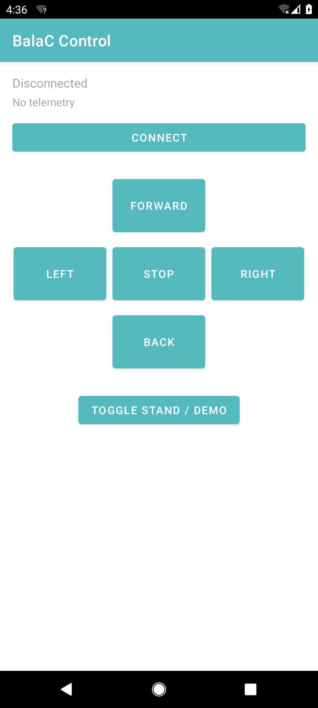

# Nesso N1 + BalaC Balancing Robot


A self-balancing robot built from the **Kiraku Labo BalaC** base with an **Arduino Nesso N1**
(ESP32-C6) as the brain. This repo has the robot firmware plus a few ways to drive and extend
it: a Bluetooth LE Android app, a micro-ROS bridge, a camera-based controller, and a Blockly
teaching example.


## Get started in 5 minutes

The prebuilt files on the [latest release](https://github.com/edgeimpulse/nesso-balac-example/releases/latest) page let you get going without installing a toolchain.

### Drive an assembled robot (about 2 minutes)

1. Download the `balac-control-*.apk` from the [latest release](https://github.com/edgeimpulse/nesso-balac-example/releases/latest) and install it on an Android phone. Turn on "Install unknown apps" if the phone asks.
2. Power on the robot, open BalaC Control, tap Connect, then hold Forward, Back, Left or Right.

### Flash the firmware (about 5 minutes)

1. If the [latest release](https://github.com/edgeimpulse/nesso-balac-example/releases/latest) has a `balac-firmware-*.bin`, you can flash it from the browser with [esptool-js](https://espressif.github.io/esptool-js/). Connect the Nesso N1 over USB-C, pick the serial port, choose the `.bin`, and click Program.
2. If there is no binary yet, open [BalaCplus/BalaCplus.ino](BalaCplus/BalaCplus.ino) in the Arduino IDE, install the Arduino Nesso N1 core and the [libraries](README-libs.md), and click Upload. There is more detail in the [Flash the firmware](#1-flash-the-firmware) section below.

For background, see the [architecture notes](docs/architecture.md) and the [bill of materials](docs/BOM.md).

```
BalaCplus/               Balancing-robot firmware for the Nesso N1 (+ BLE remote control)
android-balac-control/   Android app to drive the robot over Bluetooth LE
microros_imu_publisher/  micro-ROS sketch: publishes /imu, subscribes to /cmd_vel
ros2_camera_control/     Raspberry Pi ROS 2 node that drives the robot from a camera
blockly/                 Visual-programming teaching example (generates rclpy teleop)
README-libs.md           Arduino libraries needed to build the firmware
README-microros.md       micro-ROS setup notes
docs/                    Architecture notes and bill of materials
.github/workflows/       CI that builds the APK and publishes release artifacts
```

## Hardware

- **Nesso N1** (ESP32-C6): the MCU, display, buttons, BMI270 IMU and battery gauge.
- **BalaC base**: two motors driven through an I²C motor driver at address `0x38`.
- The two share one I²C bus (motor driver at `0x38`, IMU at `0x68`).

See the [bill of materials](docs/BOM.md) for the full parts list.

## How it fits together

The Android app is a Bluetooth LE client. It sends short drive commands (`D,throttle,steer`,
`S` to stop, `M` to change mode) to the Nesso N1, and the firmware sends telemetry back
(battery, tilt and whether the robot is standing). On the robot, the BalaCplus firmware reads
tilt and rotation from the BMI270 IMU over I²C (address `0x68`) to stay upright, and drives the
left and right motors through the BalaC motor driver over the same I²C bus (address `0x38`).

The [architecture notes](docs/architecture.md) describe both this Bluetooth path and the
optional micro-ROS path in more detail.

## 1. Flash the firmware

1. Install the **Arduino Nesso N1** board core from the Boards Manager. It provides
   `Arduino_Nesso_N1.h` and the global `IMU`.
2. Install the libraries listed in [README-libs.md](README-libs.md).
3. Open [BalaCplus/BalaCplus.ino](BalaCplus/BalaCplus.ino), select the Nesso N1 board, and upload.
4. Bringing it up to balance:
   - Lay the robot flat when it powers on. Cal-1 (gyro bias) runs on its own.
   - Stand it upright and hold it there until Cal-2 triggers and it starts balancing.
   - A short press on `KEY1` re-runs Cal-1. A long press on `KEY2` switches between Stand and Demo mode.

## 2. Drive it over Bluetooth (Android)

The firmware advertises as `BalaC-Nesso` and exposes a Nordic UART Service (NUS). Build and
install the app in [android-balac-control/](android-balac-control/), tap Connect, and use the
on-screen buttons. Remote driving works in Stand mode; Demo mode ignores it.



### BLE control protocol (NUS)

| Item | UUID |
|------|------|
| Service | `6E400001-B5A3-F393-E0A9-E50E24DCCA9E` |
| RX (app to robot, write) | `6E400002-B5A3-F393-E0A9-E50E24DCCA9E` |
| TX (robot to app, notify) | `6E400003-B5A3-F393-E0A9-E50E24DCCA9E` |

Commands (ASCII, newline-terminated) written to **RX**:

| Command | Meaning |
|---------|---------|
| `D,<throttle>,<steer>` | Drive. `throttle` and `steer` are each `-100..100`. |
| `S` | Stop (throttle and steer to zero). |
| `M` | Toggle Stand / Demo mode. |

Telemetry notified on **TX** roughly once per second:

```
T,<battery%>,<tiltDegrees>,<standing 0|1>
```

**Safety:** if no command arrives within 600 ms the firmware zeroes the throttle, so losing the
BLE link brings the robot to a stop.

## 3. Drive it from ROS 2 (optional)

[microros_imu_publisher/](microros_imu_publisher/) turns the robot into a micro-ROS node that
publishes `/imu` and subscribes to `/cmd_vel` (`geometry_msgs/Twist`). Follow
[README-microros.md](README-microros.md) to run the micro-ROS agent, then drive it from either:

- [ros2_camera_control/](ros2_camera_control/), a Raspberry Pi with a USB camera.
- [blockly/](blockly/), a Blockly teaching example that generates `rclpy` code.

Note: the Bluetooth remote (section 2) and the micro-ROS transport (section 3) are two separate
builds of the firmware. Pick the one that matches how you want to drive the robot.
