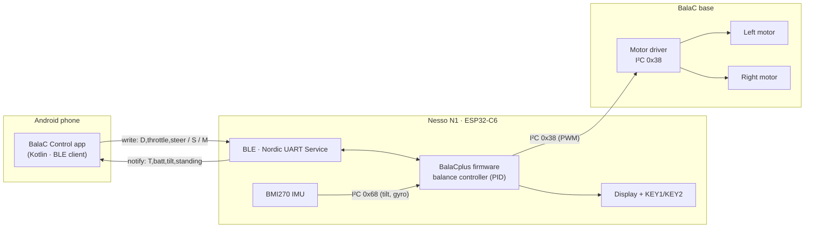
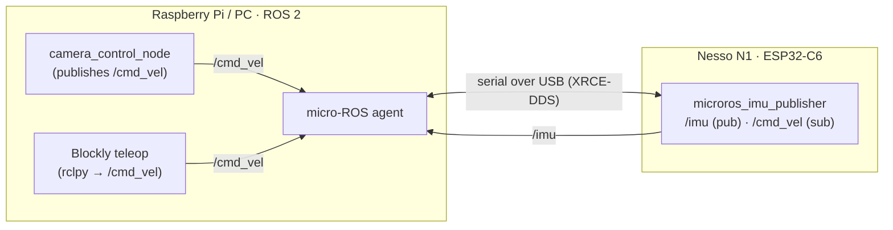

# Architecture

The robot has two independent control paths that share the same balancing firmware on the
Nesso N1: a **Bluetooth LE** remote (the Android app) and an optional **micro-ROS** transport
(camera / Blockly over ROS 2).

## Bluetooth LE control path

The app writes short ASCII commands to the RX characteristic; the firmware maps `throttle`/`steer`
onto the balance controller (`moveRate` and yaw) while it keeps the robot upright from the IMU.
If no command arrives within 600 ms the firmware zeroes the throttle (failsafe).

## micro-ROS control path (optional)

## Repository map

| Path | Role |
|------|------|
| `BalaCplus/` | Balancing firmware for the Nesso N1 (+ BLE remote control) |
| `android-balac-control/` | Android app (BLE client) |
| `microros_imu_publisher/` | micro-ROS node: publishes `/imu`, subscribes to `/cmd_vel` |
| `ros2_camera_control/` | Raspberry Pi camera node that publishes `/cmd_vel` |
| `blockly/` | Blockly → `rclpy` teaching example |
| `.github/workflows/` | CI: builds the APK and publishes release artifacts |
